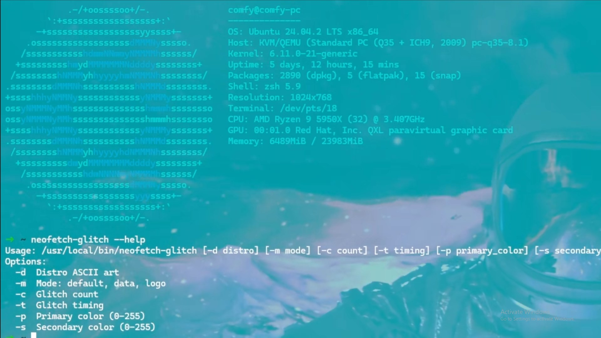

# Neofetch-Glitch

A Bash script that adds a glitch effect to neofetch output.

## Demo

## Features
- Modes: `default`, `data`, `logo`.
- Customizable glitch count, timing, colors.
- Add to $PATH with `--link`.